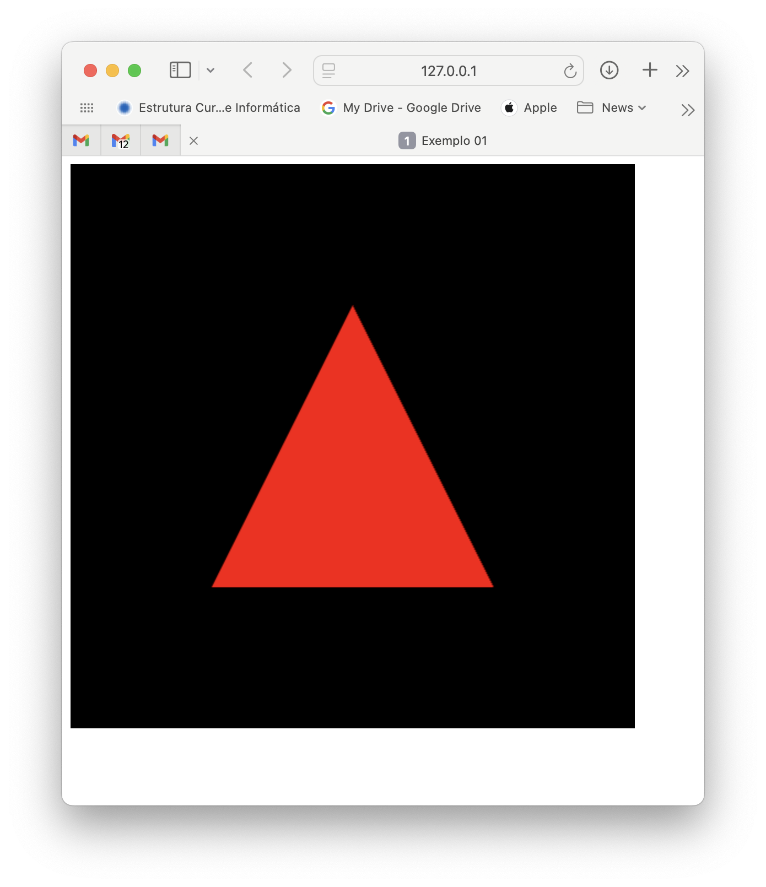

# Practical lesson 1 - Setting up the development environment and introductory examples

In the Computer Graphics and Interfaces lessons, we will use the WebGL API to develop our programmes and projects. Although our applications, because they run in a browser, do not require much help in terms of IDE - for example, it is not necessary to compile our programmes - using an IDE has other advantages.

The chosen IDE is Microsoft Visual Studio Code, which has versions for MacOS, Windows, and Linux. This IDE is extensible, making it possible to install a series of extensions to meet a wide range of needs. In our case, we will need the following extensions for now:

- Live server - a web server with support for live reloading of static and dynamic pages
- WebGL GLSL Editor - support for syntax highlighting in shaders

To open the extensions panel, press **CTRL**+**SHIFT**+**X** (Windows and Linux) or  **CMD**+**Shift**+**X** (Mac), search for the extension by typing its name, and select the ‘Install’ option.

**Hint**: Visual Studio Code shortcuts for [Mac](https://code.visualstudio.com/shortcuts/keyboard-shortcuts-macos.pdf), [Linux](https://code.visualstudio.com/shortcuts/keyboard-shortcuts-linux.pdf) and [Windows](https://code.visualstudio.com/shortcuts/keyboard-shortcuts-windows.pdf).

## Repository for CGI

During the semester, we will adopt a rigid structure for our folders. The adopted structure is illustrated below:

```.

├── doc
│   ├── labs
│   │   └── lab01.md
│   └── prjs
├── README.md
└── src
    ├── labs
    │   └── ex01
    │       ├── app.js
    │       ├── index.html
    │       └── shaders
    │           ├── shader.frag
    │           └── shader.vert
    ├── libs
    │   ├── dat.gui.min.js
    │   ├── dat.gui.module.js
    │   ├── dat.gui.module.js.map
    │   ├── MV.js
    │   ├── objects
    │   │   ├── ...
    │   │   └── ...
    │   ├── stack.js
    │   ├── three.module.js
    │   └── utils.js
    └── prjs
        ├── prj1
        ├── prj2
        └── prj3
```

The following stands out in this structure:

- A [doc](../../doc/) folder containing all the scripts for practical classes and project statements.
- A [src](../../src/) folder containing all the source code.

Inside the [src](../../src/) folder, the structure is as follows: 
- A [libs](../../src/libs/) folder where the files corresponding to the libraries used are stored.
- A [labs](../../src/labs/) folder to store the folders with the code related to the exercises to be solved in practical classes.
- One folder per exercise, such as [ex01](../../src/labs/ex01/), inside the [labs](../../src/labs/) folder, for each exercise proposed. This folder will contain all the files necessary to solve the respective exercise, except for the libraries mentioned above. **The contents of these folders should not be edited by students**, as they will be updated in the repository by the teaching team (for example, to make the solutions available).
- A folder with your proposed solution for a given exercise, such as [my-ex01](../../src/labs/my-ex01/), which should be initialised with a full copy of the [ex01](../../src/labs/ex01/) folder, if it exists in the repository, to start solving the exercise. Each student/group should write their code in this folder.
- A folder [prjs](../../src/prjs/) to store the project solutions for assessment.

For each exercise, we will also follow the following convention to organise the respective files (see [ex01](../../src/labs/ex01/) above):

- An [index.html](../../src/labs/ex01/index.html) file with the HTML code corresponding to the structure of our application
An [app.js](../../src/labs/ex01/app.js) file with the main application code
- A [shaders](../../src/labs/ex01/shaders/) folder to store all the shaders used by the application (the extensions for these shaders will be ```.vert``` and ```.frag``` for vertex and fragment shaders, respectively.
- If there are more JavaScript files needed, other than those in the library, they can be placed at the same level as the main file, or stored in a folder named ```js```

## Testing the environment

Before we move on to the exercises, let's test whether the working environment is properly configured. To do this, in Visual Studio Code, select the file [labs/ex01/index.html](../../src/labs/ex01/index.html) and, with the right mouse button, choose the option **Open With Live Server**.

If everything is OK, a page will appear in your browser that looks like this:




If you did not get this result, review the previous steps. The most common error is that the folder opened in Visual Studio Code does not have access to all files, only the folder related to the example you are trying to run.

If everything is OK, then repeat the process for the file [labs/ex02/index.html](../../src/labs/ex02/index.html). 

The result will be exactly the same, although the application is completely different. Compare the contents of the ```app.js``` files in each of the examples. In the first case, we are using the WebGL API (lower level) directly, while in the second, we are using a higher-level API - [threejs](https://threejs.org).

## Application page structure

In this section, we will analyse the structure of our example application page. The file with the page structure is named [index.html](../../src/labs/ex01/index.html) and is located in the root of the [ex01](../../src/labs/ex01/) folder.

The content of this file is quite simple, consisting of a page that loads the script ([app.js](../../src/labs/ex01/app.js)) with the main code of our application, using the ```<script>``` element, as well as a ```<canvas>``` element, which is used to create an area on the page where we can draw our triangle in WebGL. Here it is:

```html
<!DOCTYPE html>
<html>
    <head>
        <title>Example 01</title>
    </head>
    <body>
        <script type="module" src="./app.js"></script>
        <canvas id="gl-canvas" width="512" height="512"></canvas>
    </body>    
</html>
```

Note that the ```<canvas>``` element has dimensions specified using the ```width``` and ```height``` attributes and also has an identifier attribute (```id```) that allows us to easily access it from our JavaScript code.

## Main application code

### Skeleton

The contents of the [app.js](../../src/labs/ex01/app.js) file are much more elaborate. The skeleton of our programme is as follows:

```js
// import required libraries and additional scripts
// ...

// Global variables declaration
// ...

function setup(...)
{
    // Setup
    
    // Get the canvas object and create the webgl context

    // Build a GLSL programme (vertex + fragment shader)

    // Create required data buffers and send them to the GPU

    // Setup the viewport

    // Setup the background colour
    
    // Call animate for the first time
    window.requestAnimationFrame(animate);
}

function animate()
{
    // Ask browser to call animate again on next refresh cycle
    window.requestAnimationFrame(animate);

    // Drawing code
}

// load the shader sources and pass them to the setup function
// Code execution starts here...
setup()
```

If we look at the code above, the programme's entry point is on the last line, outside of all the declared functions. By choice, the ```setup()``` function will need to be given the source code for all the shaders used by the programme. Therefore, the first step will be to load those same shaders.

### Loading shaders

Regarding the loading of shaders, in the [utils.js](../../src/libs/utils.js) library, we can find two functions that will help us:

- ```loadShadersFromURLS()``` - Loads shaders **asynchronously** from their URLs. This function receives as an argument an array of strings, with the name of each shader and a prefix that will be the initial part of the URL, common to the different shaders. By default, the prefix is ‘shaders’.
- ```loadShadersFromScripts()``` - Loads the shaders **synchronously** from the IDs of the respective scripts embedded in the HTML file.
In this example, we will load the shaders asynchronously and wait for them all to load before letting the programme proceed to the setup() function. The final line is then:

```js
loadShadersFromURLS([‘shader.vert’, ‘shader.frag’])
   .then(shaders => setup(shaders));
```

Note that the prefix has been omitted, so we will have to store the two shaders in a folder named [shaders](../../src/labs/ex01/shaders/). The function ```loadShadersFromURLS()``` returns immediately, although not with the result we want (the source code of the shaders). The use of ```.then(result => ...)``` allows us to wait for the asynchronous tasks that are executed within that function to finish and then use the result. In this case, the result was named ```shaders``` and used to call the ```setup()``` function.

The result of the ```loadShadersFromURLS()``` function is an object that works like a dictionary, translating the name of a shader (a string) into its respective source code (another string).

### Creating the WebGL context and GLSL programmes
Let's now look at what goes inside the setup() function. First, we need to obtain a reference to the ```<canvas>``` object in our document.

```js
// Global variables declaration

/** @type {WebGL2RenderingContext} */
var gl;
/** @type {WebGLProgram} */
var program;
/** @type {WebGLVertexArrayObject} */
var vao;


function setup(shaders)
{
    // ...
    
    // Get the canvas object and create the webgl context
    const canvas = document.getElementById(‘gl-canvas’);
    gl = setupWebGL(canvas);
    
    // ...
}
```
The process consists of asking the global document object to return a reference to the object that has a specific identifier - in this case ```gl-canvas```. Next, we use the ```setupWebGL()``` function from the [utils.js](../../src/libs/utils.js) library, which creates a WebGL context and associates it with the canvas. The WebGL context is nothing more than an object that allows us to access the WebGL API.

At this point, we can now call functions from the WebGL API and compile the shaders to form a GLSL programme that can be used in tasks involving the drawing of graphic elements (graphic primitives) on the canvas. To form the GLSL programme, we will use the ```buildProgramFromSources()``` function from the [utils.js](../../src/libs/utils.js) library:
```js
    program = buildProgramFromSources(gl, shaders[‘shader.vert’], shaders[‘shader.frag’]);
```
The function receives three arguments:

- the WebGL context
- a string with the vertex shader source code
- a string with the fragment shader source code

Note that we obtain the source code for each shader using the dictionary that is passed as an argument to the ```setup()``` function. We recommend reading the source code for the ```buildProgramFromSources()``` function to understand the API calls that are made there. We still need to add the necessary declarations to import the functions used from the [utils.js](../../src/libs/utils.js) library:

```js
import { loadShadersFromURLS, setupWebGL, buildProgramFromSources } from ‘../../libs/utils.js’;
```

### Passing geometry to the GPU
In order to draw primitives using the GPU, we must perform the following steps:

- Create buffers that will contain the attributes associated with each vertex
- Fill the buffers with the data for each vertex
- Send the buffers with the data to the GPU
- Teach the GPU to consume the data in the buffers, associating them with the attributes of the vertex shader used by the GLSL programme that will be used.

Our goal is to draw only a simple red triangle. Thus, the only data that varies from vertex to vertex will be their coordinates. We will then declare a local variable that contains the vertices of our triangle:

```js
    const vertices = [ vec2(-0.5, -0.5), vec2(0.5, -0.5), vec2(0, 0.5) ];
```

In this case, it is a two-dimensional array of arrays. The type ```vec2``` is declared in the [MV.js](../../src/libs/MV.js) library, but we will deal with its import later. The following lines of code create a buffer, fill it with the vertex coordinates, and send it to the GPU:

```js
const aBuffer = gl.createBuffer();
gl.bindBuffer(gl.ARRAY_BUFFER, aBuffer);
gl.bufferData(gl.ARRAY_BUFFER, flatten(vertices), gl.STATIC_DRAW);
```

Line 3 above is the call that actually fills the buffer, which takes on the size of the data placed there. Note that when creating the buffer in line 1, nothing is said about its size. The call to the [bufferData()](https://developer.mozilla.org/en-US/docs/Web/API/WebGLRenderingContext/bufferData) function also has the particularity of not indicating, in its arguments, which buffer will be filled. Imagine a programme that has created several buffers in the meantime. How does the API know which buffer the data should be placed in? 

That is precisely why line 2 is there. In that line, the buffer created in line 1 becomes active for operations whose target is a buffer of type (```ARRAY_BUFFER```). That same target is indicated in line 3, in the first argument of the call. Our array declared above, with the coordinates of the three vertices of the triangle, cannot be passed directly, because the second argument of the bufferData() call needs to be an array of type Float32Array (a JavaScript array that uses native floating-point numbers instead of the Number type, the JavaScript data type for handling numbers). Fortunately, the [MV.js](../../src/libs/MV.js) library provides the `flatten()` function, which arranges our array of `vec2()` arrays into a one-dimensional array with the data converted to the native format. 

The next step is to teach WebGL to interpret the data in the buffer:

```js
    // Create a vertex array object to tell the GPU how to fetch vertex
    // data from the buffers, and make it current
    vao = gl.createVertexArray();
    gl.bindVertexArray(vao);

    // Get the attribute location for “a_position” attribute
    const a_position = gl.getAttribLocation(program, “a_position”);

    // Describe layout of the attribute in the buffer
    // In this case, two floats tightly packed (no empty space between
    // consecutive vertices and no offset from the start of the buffer)
    gl.vertexAttribPointer(a_position, 2, gl.FLOAT, false, 0, 0);

    // Enable attribute fetching from the array
    gl.enableVertexAttribArray(a_position);

    // By now the vertex array has all the information to be used later
    // during rendering
    gl.bindVertexArray(null);
```


The attributes of each vertex are referred to by name within the vertex shader. However, each attribute ends up being internally associated with a unique index. To explain to the API how they are organized in the currently active buffer (the one used in the [bindBuffer()] operation (https://developer.mozilla.org/en-US/docs/Web/API/WebGLRenderingContext/bindBuffer)), we first need to know the index of the attribute in the GLSL program, which is to say in the vertex shader (the attributes only concern the vertex shader, as they are values associated with vertices). Calling the [getattriblocation()](https://developer.mozilla.org/en-US/docs/Web/API/WebGLRenderingContext/getAttribLocation) function obtains the index of the ```a_position``` attribute referred to in the vertex shader that was used to create the GLSL program named program.

The call to [vertexAttribPointer](https://developer.mozilla.org/en-US/docs/Web/API/WebGLRenderingContext/vertexAttribPointer) allows us to explain to the API how to interpret the contents of the buffer with regard to this attribute. Note that a buffer can contain the values of an arbitrary set of attributes, as long as they are arranged in a regular manner. The first argument is the index of the attribute we want to specify. The second argument refers to the number of data elements associated with that attribute. In this case, it will be 2, since our data consists of 2 elements of type float. The third argument then indicates the type of each element (FLOAT). The fourth argument will always be false. Finally, the 5th and 6th arguments are, respectively, the *stride* and the *offset*. The value of *stride* indicates the number of bytes that separate the first byte of the first element of the attribute for vertex i from the first byte of the first element of the same attribute for vertex i+1. The value of *offset* indicates the number of bytes we must skip from the beginning of the buffer to reach the first byte containing the attribute value for the first vertex. This allows us to group several attributes of our vertices in the same buffer by zones, either interleaved or by splitting the buffer into zones with different layouts.

Finally, we activate the use of that attribute using the [enableVertexAttribArray()](https://developer.mozilla.org/en-US/docs/Web/API/WebGLRenderingContext/enableVertexAttribArray) function. This line of code may seem strange, but there are situations where we want to disable the attributes in the buffer and use the same value for all vertices. In this case, the attribute will need to be disabled with [disableVertexAttribArray](https://developer.mozilla.org/en-US/docs/Web/API/WebGLRenderingContext/disableVertexAttribArray) and we must use one of the functions [vertexAttrib[1234]f[v]()] (https://developer.mozilla.org/en-US/docs/Web/API/WebGLRenderingContext/vertexAttrib) functions to specify the default value that will be assigned to all vertices.

All these operations are recorded in a vao object of type [WebGLVertexArrayObject](https://developer.mozilla.org/en-US/docs/Web/API/WebGLVertexArrayObject). Hence the initial instructions that create this object and make it active. At the end, the vao is disabled.

### Viewport and background color specification
The viewport consists of a rectangular area within our canvas. In the call below:

```js
gl.viewport(0, 0, canvas.width, canvas.height);
```

The viewport will have its lower left corner at point (0,0) and its width and height identical to those of the canvas, thus occupying its entire area. The reference here is located in the lower left corner of the canvas and the units are pixels.

The background color, when clearing the framebuffer, is stored in a WebGL API state variable. This state variable is modified with the call:

```js
    gl.clearColor(0.0, 0.0, 0.0, 1.0);
```

In this case, we are setting the R, G, B, A color corresponding to black, completely opaque.

### The animation cycle
Finally, the animation cycle is executed with the help of the browser. The call to [requestAnimationFrame()](https://developer.mozilla.org/en-US/docs/Web/API/Window/requestAnimationFrame) tells the browser to invoke the function passed as an argument in the next refresh cycle. This is done once at the end of setup() to trigger the first call and then each time the chosen function is passed. In our case, the function is called animate(). Within this function, we will finally draw our triangle, first clearing whatever was in the framebuffer:

```js
function animate() {
    // Trigger another call for the next frame update
    window.requestAnimationFrame(animate);

    // Drawing code

    // Clear the framebuffer with the background color
    gl.clear(gl.COLOR_BUFFER_BIT);

    // Use the WebGL program created before
    gl.useProgram(program);

    // Make the vertex array object active (records how to fetch vertex data
    // from buffer)
    gl.bindVertexArray(vao);
    // Draw triangles using 3 vertices (one triangle)
    gl.drawArrays(gl.TRIANGLES, 0, 3);
    // Deactivate the vertex array object since drawing is complete
    gl.bindVertexArray(null);
}
```

First, clear the framebuffer using the [clear()](https://developer.mozilla.org/en-US/docs/Web/API/WebGLRenderingContext/clear) function, then place our GLSL program in the pipeline, causing the GPU to execute the corresponding vertex and fragment shaders when we send primitive drawing requests.

Before drawing the primitives, the Vertex Array Object (vao) is activated so that the API knows which buffers the attributes are in and how they are arranged in memory. The [drawArrays()](https://developer.mozilla.org/en-US/docs/Web/API/WebGLRenderingContext/drawArrays) function allows you to draw primitives directly, consuming data from the buffers. Alternatively, you can also use the [drawElements()](https://developer.mozilla.org/en-US/docs/Web/API/WebGLRenderingContext/drawElements) function, which uses indirection but allows you to reuse vertex data by using indexes for a vertex array.

## Shaders

Finally, we need to mention our shaders, located in the shaders folder. The content of the vertex shader shader.vert will be:

```c
#version 300 es

in vec4 a_position;

void main() {
    gl_Position = a_position;
}
```

Variables declared with the qualifier ```in``` in the vertex shader are vertex attributes. In this case, we only have one attribute (```a_position```).

The predefined variable gl_Position represents the final coordinates of the vertex after any transformations that the vertex shader has applied to the initial data. In this example, there is no transformation to be applied, so the value of the (input) attribute corresponding to the vertex is assigned. 

The fragment shader shader.frag has this content:

```c
#version 300 es

precision mediump float;

out vec4 color;

void main() {
    color = vec4(1.0f, 0.0f, 0.0f, 1.0f);
}
```

The output variable of the fragment shader can have an arbitrary name, decided by the programmer, and represents the final color to be assigned to the pixel.

## ex03 - Change the color of the triangle

Change the fill color of the triangle to green, for example, and the background color to yellow. Don't forget to make a copy of the [ex01](../../src/labs/ex01/) folder to a new folder named my-ex03, so as not to interfere with the repository folders.

Hint: the solution is not in app.js...

## ex04 - Drawing a square

Copy the contents of the [ex01](../../src/labs/ex01/) folder again to a new folder named my-ex04. 

Change the application so that it draws a square. Since WebGL does not have quadrilateral primitives (or any polygons other than triangles), you will need to use two triangles.

Finally, when your program is running, try changing the dimensions of the browser window and see what happens to the square. Try to find an explanation.

## ex05 - Filling the interior and drawing the boundary

Copy the contents of the [ex01](../../src/labs/ex01) folder again to a new folder called [my-ex05](../../src/labs/my-ex05).

Change the application so that, in addition to painting the inside of the triangle, it also draws its border in another color.

Hint: You will need to use two different fragment shaders to achieve the effect of two distinct colors. This means you will have to create two GLSL programs. Try to share the vertex shader between the two programs.

## ex-06 Drawing thousands of triangles

Copy the contents of the [ex01](../../src/labs/ex01) folder to a new folder called [my-ex06](../../src/labs/my-ex06).

Draw 10,000 small triangles, arranged randomly on the canvas, using only one call to the [drawArrays()](https://developer.mozilla.org/en-US/docs/Web/API/WebGLRenderingContext/drawArrays) function.