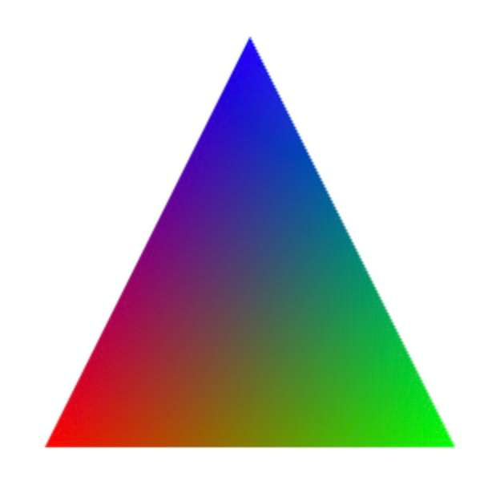

# Aula Prática 2 - Uniform, Varying, Buffer layouts

## Uniforms

Na [Sessão 01](../../doc/labs/lab01-pt.md), para resolver o [ex05](../../src/labs/ex05), apontou-se a necessidade de usar 2 *fragment shaders* para se poder pintar, com cores diferentes, quer o interior, quer a fronteira dum triângulo. Por causa disso, tornou-se necessário usar dois programas GLSL e o código ficou mais verboso e complicado. O ideal seria termos a possibilidade de enviar para o programa GLSL, a partir da nossa aplicação javascript, a cor com que pretendemos pintar o polígono. Felizmente tal é possível...

Nos nossos shaders podemos definir entradas de dados com o qualificador ```uniform```, representando valores que são constantes durante a execução dum pedido de desenho de primitivas ([drawArrays()](https://developer.mozilla.org/en-US/docs/Web/API/WebGLRenderingContext/drawArrays) ou [drawElements()](https://developer.mozilla.org/en-US/docs/Web/API/WebGLRenderingContext/drawElements)). Estas variáveis, ao contrário dos atributos(declarados com o qualificador ```in```), que só estão disponíveis nos shaders de vértices, estão disponíveis em ambos os shaders e representam a mesma entidade nos dois shaders dum programa GLSL. Por exemplo, um vertex shader que declare uma variável do tipo ```uniform``` só será compatível com um fragment shader que a declare exatamente da mesma forma ou que a omita (porque não necessita aceder ao seu valor).

Considerando que não se altera o programa GLSL, a aplicação javascript pode atribuir valores a essas variáveis uniform, num ponto A do código, os quais se manterão em vigor até serem alterados noutro ponto B, do mesmo script. Entre esses dois locais da aplicação, todas as execuções de shaders desencadeadas pelo desenho de primitivas usarão os valores correntes atribuídos pelo programa no ponto A.

Estas variáveis comportam-se, do ponto de vista dos shaders, como se se tratassem de constantes definidas externamente pela aplicação.

## ex07 - Utilização de parâmetros nos shaders

Pegue no conteúdo da pasta [ex01](../../src/labs/ex01) e copie-o para uma pasta nova com o nome [my-ex07](../../src/labs/my-ex07). Modifique o código por forma a que o fragment shader aceite uma variável ```uniform vec4``` com o nome ```u_color```:

```c
uniform vec4 u_color;
```

Não se esqueça que o shader deverá dar bom uso a esse valor que agora recebe...

As alterações no código da aplicação ([app.js](../../src/labs/my-ex07)) passam por:

- Obter a localização da variável uniform usando a função [getUniformLocation()](https://developer.mozilla.org/en-US/docs/Web/API/WebGLRenderingContext/getUniformLocation)
- Adaptar a função ```animate()``` para pintar o interior do triângulo e desenhar a sua fronteira, usando duas chamadas distintas da função [drawArrays()](https://developer.mozilla.org/en-US/docs/Web/API/WebGLRenderingContext/drawArrays)
- Usar a função [uniform4fv()](https://developer.mozilla.org/en-US/docs/Web/API/WebGLRenderingContext/uniform) para enviar para o programa GLSL a cor que o fragment shader irá usar.

## ex08 - Animar o triângulo

Vamos pegar novamente no [ex01](../../src/labs/ex01/) e animar o triângulo, fazendo-o movimentar-se horizontalmente em torno da sua posição inicial. Comece por copiar o código do ex01 para uma nova pasta, de nome [my-ex08](../../src/labs/my-ex08).

A ideia é o programa javascript ir modificando uma variável numérica que contém o deslocamento horizontal a aplicar ao triângulo. Como o deslocamento se vai aplicar às coordenadas de cada vértice, iremos necessitar de modificar o nosso vertex shader, incluindo nele uma variável ```uniform```:

```js
uniform float u_dx;
in vec4 a_position;

void main()
{
    gl_Position = a_position + vec4(u_dx, 0.0, 0.0, 0.0);
}
```

O código acima aplica o deslocamento ao valor do atributo ```a_position``` aquando da afetação da variável de saída ```gl_Position```.

Agora resta tratar de declarar uma variável no script app.js que vá mudando de valor de cada vez que se passa na função ```animate()```, e passar essa variável ao programa GLSL antes de efetuar o desenho.

## Varyings

Para além dos qualificadores ```in``` e ```uniform```, existem ainda mais 2:

- ```const``` - para declarar, localmente ao shader, uma constante, ali definida
- ```out``` - para declarar outputs do vertex shader ou do fragment shader.
  
Na maior parte dos casos, apenas irá existir uma variável declarada com ```out``` no fragment shader, a qual irá representar a cor com que o pixel irá ser pintado. Mas a história é completamente diferente no que diz respeito ao vertex shader e às variáveis ali declaradas com ```out```.

Para se tornar evidente a utilidade de variáveis declaradas como out no vertex shader, vamos imaginar que pretendemos pintar um triângulo com uma cor que resulta duma transição gradual, a partir das cores atribuídas a cada um dos seus vértices - quanto mais perto dum vértice estiver um ponto, mais perto da cor desse mesmo vértice esse ponto será pintado:



Podemos agora associar a cada vértice do triângulo 2 atributos: posição (```a_position```) e cor (```a_color```). O vertex shader afectará a variável de saída ```gl_Position``` com uma expressão que dependa do valor do atributo posição. Em relação ao atributo cor, para que ele possa vir a ser interpolado durante a discretização do triângulo, teremos que declarar uma saída adicional do nosso vertex shader, usando o modificador ```out```. Essa saída corresponderá a uma variável de tipo ```vec4```, para guardar as componentes R, G, B e Alpha (opacidade). Iremos seguir a convenção de nos referirmos a essas variáveis como *varyings*, usando o prefixo ```v_ ``` para as nomear. Neste caso seria declarada assim no vertex shader:

```c
out vec4 v_color;
```

E desta forma no fragment shader:

```c
in vec4 v_color;
```

Este emparelhamento é muito importante e diz-nos que os valores que um vertex shader atribua a uma variável declarada como ```out``` no seu código, irão ser interpolados no interior da primitiva, por exemplo no interior de um triângulo ou ao longo de uma linha, e esses valores irão surgir no fragment shader com input (```in```).

Neste exemplo o fragment shader deverá atribuir à sua variável de saída ```color```, o valor que entrou nesse *varying*.

**Nota**: Na versão 1 do WebGL, as variáveis *varying* (outputs do vertex shader / inputs do fragment shader) eram declaradas com o modificador ```varying```, em vez de ```in``` / ```out```.

## ex09 - 1 buffer para cada atributo

Crie uma nova pasta [my-ex09](../../src/labs/my-ex09). Pode usar o código do [ex01](../../src/labs/ex01/) para começar. Use 1 buffer para guardar as coordenadas dos vértices:

| Coordenadas |
| ----------- |
| $x_0$       |
| $y_0$       |
| $x_1$       |
| $y_1$       |
| ...         |
| $x_n$       |
| $y_n$       |

e um buffer para guardar as cores desses mesmos vértices:

| Cores |
| ----- |
| $r_0$ |
| $g_0$ |
| $b_0$ |
| $r_1$ |
| $g_1$ |
| $b_1$ |
| ...   |
| $r_n$ |
| $g_n$ |
| $b_n$ |

de modo a desenhar o triângulo mostrado.

## ex10 - 1 buffer partilhado para os dois atributos

Copie a pasta com a sua solução do [ex09](../../src/labs/my-ex09) para duas novas pastas  [my-ex10a](../../src/labs/my-ex10a) e [my-ex10b](../../src/labs/my-ex10b).

Adapte o código de forma a usar apenas um buffer. Experimente fazer de duas formas distintas:

- [my-ex10a](../../src/labs/my-ex10a) - Guardando primeiro no buffer os dados relativos às coordenadas de todos os vértices, seguidos dos dados relativos às cores desses mesmos vértices $(x1, y1, x2, y2, x3, y3, r1, g1, b1, r2, g2, b2, r3, g3, b3)$ 
- [my-ex10b](../../src/labs/my-ex10b) - Guardando no buffer a informação de cada vértice em posições de memória contíguas, alternando a informação relativa à posição com a da cor para cada vértice $(x1, y1, r1, g1, b1, x2, y2, r2, g2, b2, x3, y3, r3, g3, b3)$

Como exercício, experimente variantes onde a posição dos vértices no programa javascript é constituída por pontos 2D $(x,y)$ vs. pontos 3D $(x,y,0)$. Faça o mesmo para a cor, mas agora com coordenadas 3D (RGB) e 4D (RGBA). A coordenada A representa a opacidade da cor, o valor 1 significa que a cor é totalmente opaca e 0 significa que é totalmente transparente, logo invisível.

## ex11 - Morphing

Crie uma nova pasta [my-ex11](../../src/labs/my-ex11). Escreva um programa que faça morphing dum polígono noutro, com o mesmo número de vértices. 

**Ajuda**: necessita associar a cada vértice duas posições: a inicial e a final e misturá-las no shader com a função [mix()](https://thebookofshaders.com/glossary/?search=mix).
